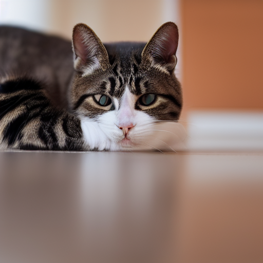
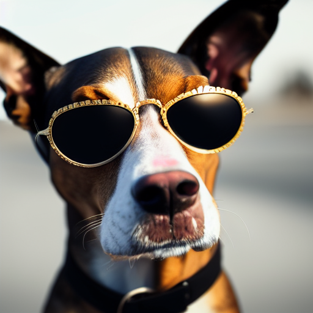
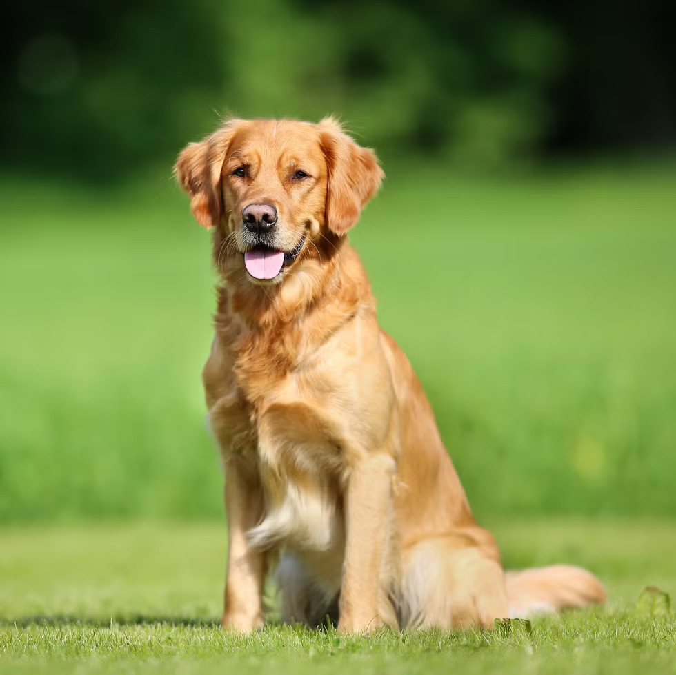
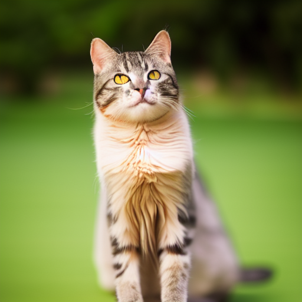
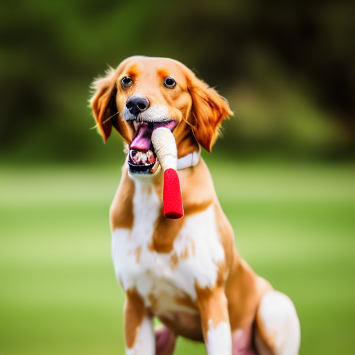

# Stable Diffusion from Scratch 🧠🎨

This is an implementation of **Stable Diffusion**, a latent text-to-image diffusion and image-to-image transformation model, built from scratch using PyTorch. It demonstrates the end-to-end process of converting text prompts into high-resolution images using a denoising diffusion probabilistic model (DDPM), a CLIP text encoder, and a VAE.

---

## 🧰 Project Structure

```

.
├── attention.py          # Self-attention modules used in the diffusion model
├── clip.py               # CLIP-based text encoder
├── ddpm.py               # DDPM sampler implementation
├── decoder.py            # VAE decoder (not shown, assumed to be present)
├── diffusion.py          # Core U-Net architecture for denoising
├── encoder.py            # VAE encoder
├── model\_loader.py       # Load and prepare pretrained model weights
├── model\_converter.py    # Convert Hugging Face / other checkpoint formats
├── pipeline.py           # Main generation pipeline
├── demo.ipynb            # Jupyter notebook demo to run text-to-image generation
├── data/
│   ├── vocab.json
│   ├── merges.txt
│   └── v1-5-pruned-emaonly.ckpt
├── images/
│   └── dog.jpg           # Sample input image
├── output/
│   ├── output/           # Folder containing generated output images
│   └── output2/
└── README.md             # You are here 📄

````

---

## 🚀 Features

- **Text-to-Image** generation using diffusion
- **Image-to-Image** transformation with noise control

---

## 📝 Usage

### Run from notebook

Use the Jupyter notebook to test both text-to-image and image-to-image generation:

```bash
jupyter notebook demo.ipynb
```

### Generate image from text prompt

In `demo.ipynb`, set:

```python
prompt = "A cat stretching on the floor, ultra sharp, 8k"
input_image = None
```

### Image-to-image transformation

Uncomment the following lines in the notebook:

```python
input_image = Image.open("../images/dog.jpg")
strength = 0.8  # Lower = closer to input
```

---

## 🖼 Sample Outputs

### Prompt: `"A cat stretching on the floor, ultra sharp, 8k resolution"`

<p align="center">
  
</p>

---

### Prompt: `"A dog with sunglasses, wearing comfy hat, looking at camera, highly detailed, 8k"`

<p align="center">
  
</p>

---
### Prompt: `"An athlete playing soccer, looking at camera, highly detailed, 8k"`

<p align="center">
  
</p>

---
### Prompt: `"An athlete playing football, looking at camera, highly detailed, 8k"`

<p align="center">
  
</p>

---
## 🐾 Image-to-Image Transformation Example

Using the prompt:

> **"A cat stretching on the floor, highly detailed, ultra sharp, cinematic, 100mm lens, 8k resolution."**

We transformed an input image of a dog into a new image aligned with the text description.

| Input Image (`dog.jpg`) | Output Image (`output5.png`) |
|--------------------------|---------------------------------------------|
|     |  |

- `strength = 0.9` → High transformation, less similarity to input image
- The model retains some spatial structure but aligns the output to the prompt
---
## 🐾 Image-to-Image Transformation Example

Using the prompt:

> **"A dog with a bone in its mouth, highly detailed, ultra sharp, cinematic, 100mm lens, 8k resolution."**

We transformed an input image of a dog into a new image aligned with the text description.

| Input Image (`dog.jpg`) | Output Image (`output6.png`) |
|--------------------------|---------------------------------------------|
|     |  |

- `strength = 0.9` → High transformation, less similarity to input image
- The model retains some spatial structure but aligns the output to the prompt


## 📌 Notes

To run this project, you need to manually download the pretrained model weights and tokenizer files. Save them in the `data/` directory as follows:

### 🔡 Tokenizer Files
Download the following two files from [Stable Diffusion v1.5 Tokenizer](https://huggingface.co/stable-diffusion-v1-5/stable-diffusion-v1-5/tree/main/tokenizer):

- `vocab.json`
- `merges.txt`

Place them in:

```

data/vocab.json
data/merges.txt

```

### 🧠 Model Weights
Download the following model checkpoint file from [Stable Diffusion v1.5](https://huggingface.co/stable-diffusion-v1-5/stable-diffusion-v1-5/tree/main):

- `v1-5-pruned-emaonly.ckpt`

Place it in:

```

data/v1-5-pruned-emaonly.ckpt

```

These files are essential for running the text encoder and the diffusion model in the pipeline.

---

## 📚 References

* [Stable Diffusion Paper](https://arxiv.org/abs/2112.10752)
* [CompVis/stable-diffusion](https://github.com/CompVis/stable-diffusion)
* [Hugging Face Transformers](https://github.com/huggingface/transformers)

---

## 👤 Author

**Rohan Shenoy** — [GitHub Profile](https://github.com/rohanshenoy30)


